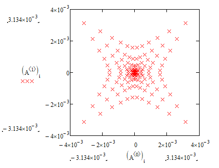

# Структура
Программа просчитывает ход лучей через оптические системы с<br>
произвольными поверхностями, поэтому луч - это элементарная<br>
состовляющая, задаваемая, положением(R), направлением(T), и<br>
статусом активности(activ), спадающем при веньетирование <br>
этого луча.<br>
Для удобства использывания лучи объединены в классы<br>
излучателей(emiter), взаимодействие их с оптическими системами<br>
и реализованно в программе.<br>
Оптические системы представленны классом system, включающему <br>
несколько поверхностей, показатели преломления и положения с <br>
ориентацией плоскостей изображения и входного зрачка с<br>
распределением лучей на нём.<br>
# Пример
В примере мы разберём ход лучей через 1 преломляющую поверхность.<br>
Для этого назначим количество поверхностей в файле rayTrace.cpp,<br>
затем в том же файле настроим все поверхности преломляющими:<br>
``` cpp
void emiterTrace() {

	for (int i = 0;i < numberOfSurface - 2;i++) {

		this->E[i + 1] = this->E[i].refractiv(this->Surface[i],this->n[i], this->n[i+1]);
		
	}
```
В случае отражающих поверхностей необходимо было бы написать:<br>
``` cpp
void emiterTrace() {

	for (int i = 0;i < numberOfSurface - 2;i++) {

		this->E[i + 1] = this->E[i].reflectToMirror(this->Surface[i]);
		
	}
```
Теперь сформируем систему:<br>
``` cpp
rayTrace::system lens;
lens.setSurface(-100, 200, 0);
vector a;
vector b;
vector r;
a.set(1, 0, 0);
b.set(0, 1, 0);
r.set(0, 0, 0);
lens.imagePlane.set(a, b, r);
lens.n[0] = 1;
lens.n[1] = 2;
```
Выше описано задание параметров поверхности, затем положение<br>
плоскости изображения, и показатели преломления.<br>
Теперь нужно задать распределение лучей на входе:<br>
  ``` cpp
const int numberRay = 12;
double d = 10.f / (numberRay - 1);
vector e[numberRay][numberRay];
for (int i = 0;i < numberRay;i++) {
    for (int j = 0;j < numberRay;j++) {
        e[i][j].set(-5.f + i * d, -5.f + j * d, 0);
    }
}
vector D;
D.set(0, 0, 1);
emiter E;
for (int i = 0;i < numberRay;i++) {
    for (int j = 0;j < numberRay;j++) {
        E.E[i][j].set(D, e[i][j], 1);
    }
}
lens.setEntranceEmiter(E);
```
Для расчёта хода лучей осталость только прописать необходимую команду:<br>
``` cpp
lens.emiterTrace();
```
Ход лучей содержиться в массиве излучаетелей E, экземпляра системы<br>
мы выгрузим только точки пересечения лучей с плоскостью изображения<br>
``` cpp
ofstream surfaceDataOut("D.txt");
emiter res = mirror.E[2];
for (int i = 0;i < numberRay;i++) {
    for (int j = 0;j < numberRay;j++) {
        surfaceDataOut << to_string(res.E[i][j].R.x) << '\t' << to_string(res.E[i][j].R.y) << '\t' << to_string(res.E[i][j].R.z) << endl;
    }
}
surfaceDataOut.close();
```
Визуализировать полученные результаты можно следующим образом:<br>
